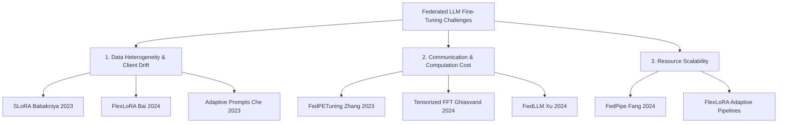

# 📝 Federated LLM Fine-Tuning: Comprehensive Literature Review

> **Subject:** Parameter-Efficient Federated Fine-Tuning of Large Language Models (PEFT-FL)  
> **Status:** Draft / Active Survey  
> **Target Publication:** ML/NLP Review Track 2024–2025

---

## 🌍 1. Introduction

### 1.1 Background & Motivation
**Federated Learning (FL)** preserves privacy by keeping training datasets decentralized on edge client environments (like medical servers, client devices, and private enterprise nodes). Simultaneously, **Large Language Models (LLMs)** have achieved state-of-the-art results across NLP tasks, but adapting them to specialized industries requires intensive private fine-tuning.

Merging these two fields yields **PEFT-FL**—where parameter-efficient adapters (like LoRA, prompts, and prefixes) are fine-tuned across client networks, allowing collaborative learning with minimal network communication overhead.

### 1.2 Core Challenges
This review systematically categorizes and analyzes state-of-the-art literature across **three fundamental challenges**:
1.  **Data Heterogeneity & Client Drift:** Mitigating mathematical divergences caused by Non-IID client distributions.
2.  **Communication & Computational Bottlenecks:** Compressing weights and utilizing forward-only pipelines for low-energy edge training.
3.  **Client Resource Heterogeneity & Scalability:** Scaling pipelines across devices with wildly differing GPU/VRAM capabilities.

---

## 🛡️ 2. Core Taxonomy: Challenges & Modern Solutions

### 2.1 Addressing Data Heterogeneity and Client Drift

In a federated layout, client datasets are rarely Independent and Identically Distributed (Non-IID). This task and linguistic distribution mismatch across clients leads to **Client Drift**—where individual local models converge toward localized objectives, pulling the global aggregated model away from global optimality.

| Study & Authors | Key Core Concept | Technical Implementation | Novel Contribution |
| :--- | :--- | :--- | :--- |
| **SLoRA**   *(Babakniya et al., 2023)* | **Sparse Low-Rank Adaptation** | Employs sparse weight matrices together with low-rank projection of adapters to stabilize aggregation. | Reduces active update size, minimizes gradients collision during merge. |
| **FlexLoRA**   *(Bai et al., 2024)* | **Dynamic & Elastic Adapter Size** | Dynamically adapts adapter sizes and styles based on local client data complexity. | Resolves divergent task profiles across highly distinct local tasks. |
| **Adaptive Prompts**   *(Che et al., 2023)* | **PEFT Prompt & Custom Optimizer** | Merges soft prompt tuning with localized learning rate schedules. | Reduces client divergence; aligns client soft prompt tokens in shared subspace. |

---

### 2.2 Reducing Communication & Computational Overhead

Collaborative fine-tuning of billions of parameters over commercial internet connections is a computational bottleneck. Modern work actively cuts gradient transfer packages and hardware consumption.

*   **FedPETuning (Zhang et al., 2023):**
    <callout icon="💡" color="gray_bg">
    **Methodology:** Restricts all shared parameters strictly to a small set of soft tokens or adapters, keeping frozen LLM weights client-side. Accomplishes up to 99% bandwidth savings compared to full weight exchanges.
    </callout>
*   **Tensorized FFT (Ghiasvand et al., 2024):**
    Uses tensor decomposition to aggressively compress structural updates before dispatching them over TCP/IP connections. Preserves global model accuracy while slashing communication packets by more than 10-fold.
*   **FwdLLM (Xu et al., 2024):**
    Redesigns edge training by relying on **forward-only perturbations** (backpropagation-free calculations). This drastically reduces VRAM requirements, making federated updates feasible on standard edge devices with no local backprop pipelines.

---

### 2.3 Enhancing General Scalability Across Edge Nodes

Edge nodes (commercial clusters, local workstations, mobile devices) exhibit severe hardware disparities—varying from a single V100 GPU (32GB) to deep multi-node A100 setups (80GB+).

*   **FedPipe (Fang et al., 2024):**
    An automated federated pipeline that seamlessly orchestrates mixed-precision training, low-rank adaptations, and model quantization.
    *   *SVD Filtering:* Evaluates the importance of weight layers via SVD (Singular Value Decomposition) to select which layers to tune.
    *   *Adaptive Training:* Assigns quantized weights and variable batch sizes recursively based on live performance metrics from heterogeneous clients.

---

## 🔮 3. Future Research Directions

1.  **Advanced Heterogeneous Aggregation:** Establishing robust aggregation methods that can merge mathematically varied adapter formats (varying ranks and sparsities) natively.
2.  **Privacy-Enhanced PEFT-FL:** Integrating secure multiparty computation (SMPC) or differential privacy (DP) into highly compact dynamic adapters without causing severe convergence degradation.
3.  **Asynchronous Scheduling:** Shifting away from synchronous training rounds to robust asynchronous setups, preventing slow or offline edge devices (stragglers) from stalling the overall global aggregation cycle.
