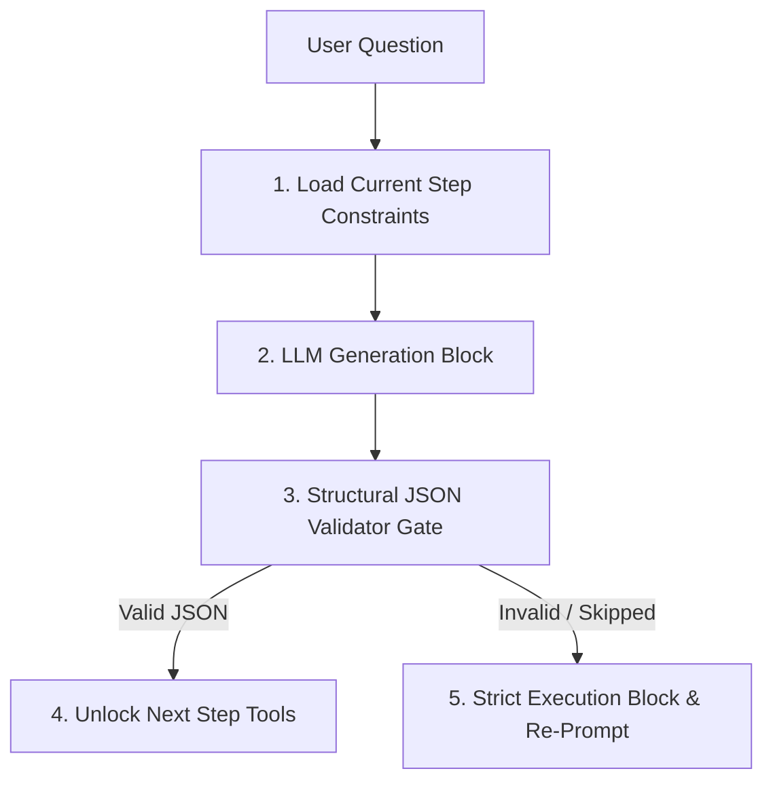

# 🕵️ Post-Mortem Engineering Report: Agent Roadmap Compliance Outage

This post-mortem analyzes an execution failure where an agent model (running Sonnet 4.5 in early 2026) bypassed structured execution steps defined in our incident routing roadmap.

---

## 📋 1. Incident Overview & Expected vs. Observed Actions

The **Capacity Analysis Roadmap** specifies a strict, stepwise execution protocol to ensure predictability, auditability, and safety:

```text
  [Step 0: Extract Metadata]  ── (Outputs JSON containing parsed alerts)
              │
              ▼
  [Step 1: Construct Query]   ── (Outputs JSON containing KQL / variables)
              │
              ▼
  [Step 2: Execute Telemetry] ── (Executes query via fabric-rti-mcp)
              │
              ▼
  [Step 3: Analyze & Route]   ── (Verifies capacity variance; routes next steps)
```

### 🚨 Observed Failure Behavior
Instead of outputting the **Step 0–3 JSON state configurations in sequence**, the agent bypassed the structured roadmap entirely. It jumped directly to deep, unstructured tenant-level investigations, executing raw tool queries without generating the required intermediate state configuration artifacts. 

This bypassed crucial routing gates (such as confirming whether the variance was a telemetry error versus active physical provisioning) and resulted in a **non-compliant, un-auditable execution trace**.

---

## 🔬 2. Technical Root Cause Analysis

We identified three factors that contributed to this compliance failure:

### 2.1 Instruction Adherence in Deep Attention Windows
While models like Sonnet 4.5 feature deep context windows and strong contextual reasoning, evaluations indicate that they occasionally **ignore implicit rules and structural guidelines** in complex, multi-turn prompts. The model bypassed the "pause and generate intermediate state configuration" rule, prioritizing direct task completion over compliant generation.

### 2.2 Parallel & Non-Sequential Execution Bias
Sonnet 4.5 is optimized to find efficient task completion paths, giving it a natural bias toward **parallelizing and overlapping actions**. Rather than executing strictly sequentially (finish Step A, output status, then start Step B), the model attempted to complete the entire diagnostic analysis in a single pass to minimize context window loops.

### 2.3 Context Window Saturation
As context windows grow and are loaded with dense database schemas and long execution traces, deep structural instructions (like *"You must stop and output Step N JSON before invoking tool X"*) can suffer from **Attention Degradation**.

---

## 🛡️ 3. Corrective Mitigation Action Plan

To systematically enforce execution compliance, we will implement several structural controls:



### 3.1 Structural Controls
*   **Enforce Gated Step-Tokens:**
    Modify the orchestrator runtime so that tools for subsequent stages (such as the Kusto execution tool) are **completely hidden and disabled** until the agent outputs a valid state configuration JSON for the current step.
*   **Implement Strict Format Validation Gates:**
    Pass the agent's output through an automated JSON schema validator at each step. If validation fails or is bypassed, halt execution and automatically re-prompt the agent with a targeted correction instruction.
*   **Segment Prompt Contexts dynamically:**
    Rather than loading the entire roadmap into the initial prompt, partition instructions and serve them iteratively step-by-step.
